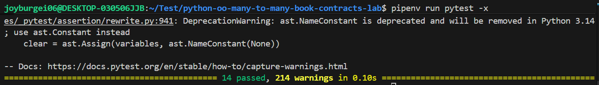

# Many-to-Many Relationships: Book Contracts Lab

## Overview

This lab models a many-to-many relationship between Authors and Books using a Contract class as an intermediary.

- An Author can have many Books.
- A Book can have many Authors.
- The relationship is managed through Contracts.

---

## Classes Implemented

### Author
**Attributes:**
- name (string)
- class attribute: all (list of all Author instances)

**Methods:**
- contracts() → returns related contracts
- books() → returns related books
- sign_contract(book, date, royalties) → creates a new Contract
- total_royalties() → returns total royalties earned

---

### Book
**Attributes:**
- title (string)
- class attribute: all (list of all Book instances)

**Methods:**
- contracts() → returns related contracts
- authors() → returns related authors

---

### Contract
**Attributes:**
- author (Author instance)
- book (Book instance)
- date (string)
- royalties (integer)
- class attribute: all (list of all Contract instances)

**Class Methods:**
- contracts_by_date(date) → returns all contracts for a given date

All properties include validation to ensure correct data types.

---

##  Test Results

All tests pass successfully.

## Screenshot of Passing Tests



---

##  How to Run Tests

```bash
pipenv install
pipenv run pytest
```

---

##  Key Concepts Practiced

- Many-to-many relationships
- Class attributes
- Instance methods
- Class methods
- Property validation
- Object collaboration